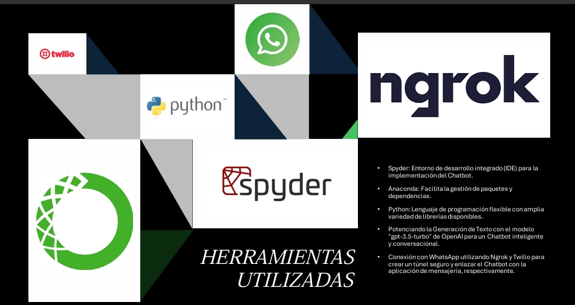

# Intelligent Chatbot 🤖

## Description

This project is an intelligent chatbot application built with Python, leveraging state-of-the-art conversational AI technologies. The chatbot integrates seamless message exchange, natural language processing, and external data management to deliver a robust user experience.

## Key Highlights:

-Conversational AI: Powered by LangChain and ChatOpenAI, the chatbot utilizes conversational retrieval chains to provide accurate and context-aware responses.

-Data Embedding and Retrieval: Uses Chroma for vector storage and OpenAI Embeddings to enhance document search and response generation.

-Data Logging: Features Google Sheets integration using gspread and Google OAuth2 Credentials to log and manage conversation data in Excel sheets.

## Libraries Used:

-Flask: Application framework
-LangChain: Conversational AI and retrieval chains
-ChatOpenAI: Advanced AI model for chat
-Chroma: Vector storage for embeddings
-Twilio: Messaging API for user interaction
-Gspread: Data logging to Google Sheets

This chatbot is a powerful tool for enhancing user interactions, automating responses, and managing data seamlessly. The repository includes well-documented code to facilitate easy setup and customization.
